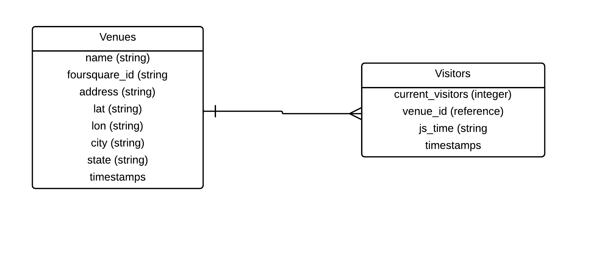

# Hackerati Full Stack Coding Challenge

### Project Description

This is a web app I built to complete the Hackerati [Full-Stack coding challenge](https://docs.google.com/document/d/1fDUDj2siKOHo6vGit5LAVnvNEqxC_3N3IdHmBIP6mpE/edit). 

The assignment was to built a system to collect data that is generated on an interval (once a minute/hour/day/etc). Store in a database; record time and data value. Then build a web app that displays a graph of the collected data with your choice of intervals. Add a table report of the data with column headings. The table should be placed below the graph. 

### Links

* [Hosted App on Heroku](http://boiling-sierra-7303.herokuapp.com/)
* [GitHub Page](https://github.com/jasonleibowitz/interval_app)
* [Jason Leibowitz's Online Portfolio](http://jasonleibowitz.org/)

### Entity Relationship Diagram (ERD)

### Technologies Used

* APIs
	* [Foursquare](https://developer.foursquare.com/)
* Gems
	* [HTTParty](https://github.com/jnunemaker/httparty)
	* [Figaro](https://github.com/laserlemon/figaro)
* JavaScript Libraries
	* [jQuery](http://jquery.com/)
	* [ChartJS](http://www.chartjs.org/)
* Core Technologies
	* [Ruby on Rails](http://rubyonrails.org/)
	* [PostgreSQL](http://www.postgresql.org/)